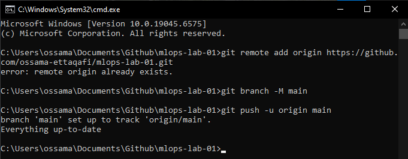
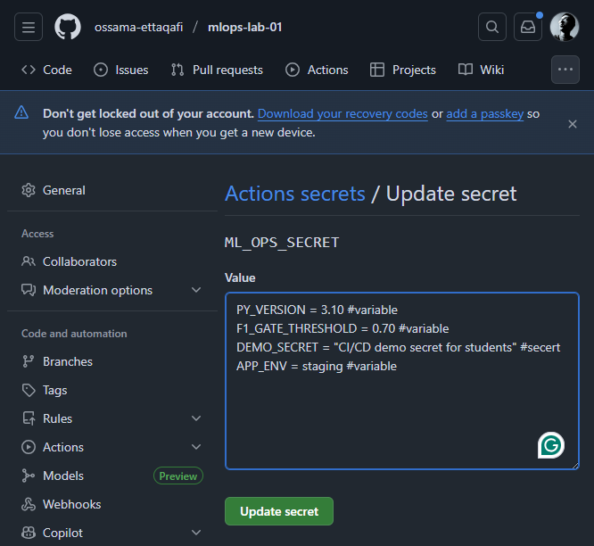
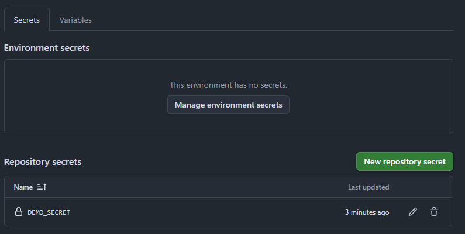
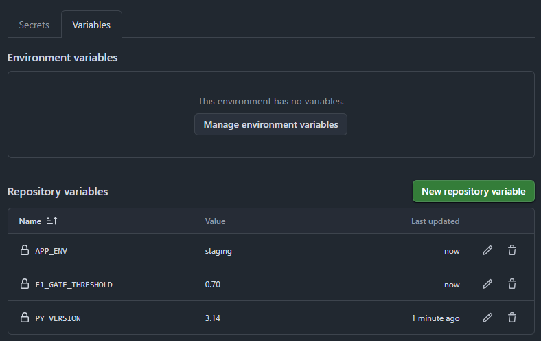
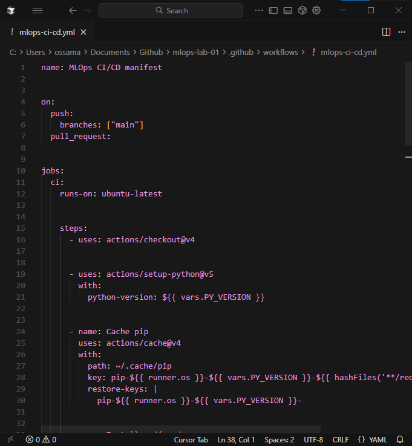
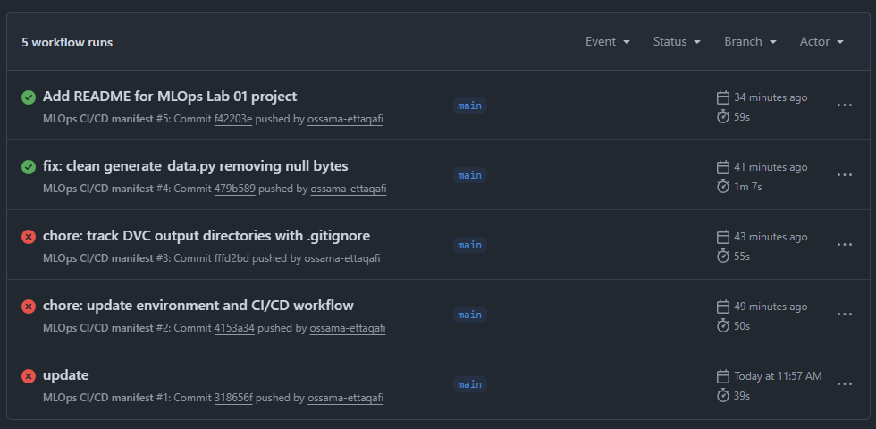

# Étapes Lab 4 : CI/CD Pipeline

## Étape 1 : Créer le dépôt GitHub et connecter le remote

## Étape 2 : Définir les secrets GitHub

## Étape 3 : Créer le workflow CI/CD

## Étape 4 : Commit et push

